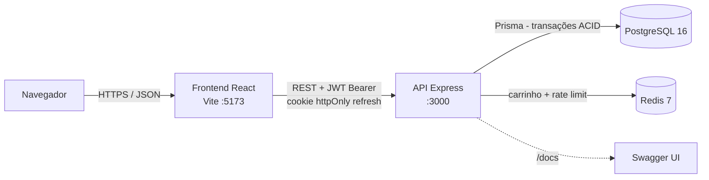
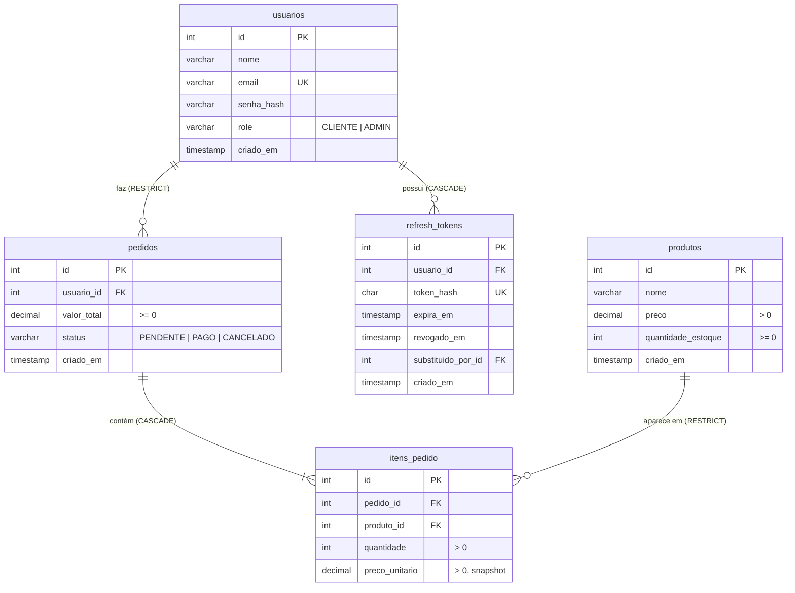
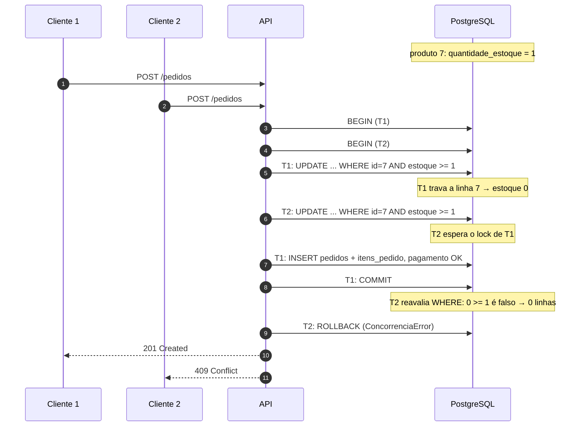

# EcommercePro — Especificação Técnica

> Documento-fonte das fases de implementação. Nenhum código é escrito antes desta spec ser aprovada; qualquer mudança de decisão entra aqui primeiro, via PR.

**Status:** rascunho para aprovação · **Versão:** 0.1

---

## 1. Visão e escopo

Plataforma de e-commerce onde usuários autenticados navegam por produtos, gerenciam um carrinho e realizam pedidos, com **atualização de estoque atômica e segura contra condições de corrida**. O diferencial técnico é o checkout: dois clientes disputando a última unidade nunca podem ambos concluir a compra, e o estoque nunca fica negativo.

### Dentro do escopo
- Cadastro, login, refresh com rotação e logout.
- RBAC com dois papéis: `CLIENTE` e `ADMIN`.
- Catálogo de produtos (público), CRUD e ajuste de estoque (admin).
- Carrinho por usuário no Redis.
- Checkout transacional com rollback em estoque insuficiente, concorrência ou falha de pagamento.
- Relatório de vendas (admin).
- Rate limiting via Redis.
- Swagger/OpenAPI, Docker Compose, README com diagrama, CI.

### Fora do escopo
- Multi-vendedor (marketplace com sellers e split de pedidos).
- Gateway de pagamento real (o pagamento é **simulado**, ver §6.5 e §13).
- Deploy público, observabilidade (métricas e traces), e-mail, frete, cupons, imagens de produto.

---

## 2. Stack

| Camada | Tecnologia |
|---|---|
| Frontend | React + TypeScript + Tailwind CSS (Vite) |
| Backend | Node.js + Express + TypeScript |
| Banco relacional | PostgreSQL 16, acessado via Prisma ORM |
| Cache / rate limiting | Redis 7 (carrinho + `rate-limit-redis`) |
| Validação | zod |
| Auth | `jsonwebtoken` (access token), `bcrypt` (hash de senha) |
| Documentação de API | OpenAPI 3 + `swagger-ui-express` em `/docs` |
| Testes | Vitest + Supertest contra Postgres e Redis reais |
| Infra local | Docker Compose |
| CI | GitHub Actions |

---

## 3. Arquitetura



### Camadas do backend

`routes → middlewares (auth, role, validate, rateLimit) → controller → service → Prisma / Redis`

- **routes**: declaração de rotas e middlewares por rota.
- **controller**: traduz HTTP ↔ chamada de service; não contém regra de negócio.
- **service**: regra de negócio e transações (`checkout.service.ts` contém `realizarCheckout`).
- **errors**: classes de erro de domínio mapeadas para HTTP no `errorHandler`.

### Estrutura de pastas

```
ecommercepro/
├── docker-compose.yml
├── SPEC.md
├── README.md
├── .github/workflows/ci.yml
├── backend/
│   ├── prisma/
│   │   ├── schema.prisma
│   │   ├── migrations/0001_init/migration.sql
│   │   └── seed.ts
│   ├── src/
│   │   ├── app.ts / server.ts
│   │   ├── config/env.ts
│   │   ├── lib/ (prisma.ts, redis.ts)
│   │   ├── errors/
│   │   ├── middlewares/ (auth.ts, requireRole.ts, validate.ts, rateLimit.ts, errorHandler.ts)
│   │   ├── modules/
│   │   │   ├── auth/
│   │   │   ├── produtos/
│   │   │   ├── carrinho/
│   │   │   ├── pedidos/ (checkout.service.ts)
│   │   │   └── relatorios/
│   │   └── docs/openapi.ts
│   └── tests/
└── frontend/
    └── src/ (api/, pages/, components/, auth/, routes/)
```

---

## 4. Autenticação e autorização

### 4.1 Tokens

| Token | Formato | Validade | Armazenamento no cliente |
|---|---|---|---|
| Access | JWT HS256, claims `sub` (id do usuário), `role`, `iat`, `exp` | 15 min | Memória (estado React), nunca em `localStorage` |
| Refresh | String opaca aleatória de 256 bits | 7 dias | Cookie `httpOnly`, `Secure` (prod), `SameSite=Strict`, `Path=/auth` |

A autenticação das rotas é **stateless**: o middleware só valida a assinatura e a expiração do JWT, sem consultar o banco. O estado no servidor existe apenas para os refresh tokens, e isso é necessário: sem ele não há rotação nem revogação.

### 4.2 Rotação de refresh token com detecção de reuso

1. `POST /auth/login` gera o access token e um refresh token. No banco grava-se só o **hash SHA-256** do refresh.
2. `POST /auth/refresh` lê o cookie e calcula o hash:
   - **Válido** (existe, não revogado, não expirado): revoga o token atual, cria um novo, liga o antigo ao novo (`substituido_por_id`) e devolve um novo par de tokens.
   - **Já revogado** (reuso): sinal de token roubado. Revoga **todos** os refresh tokens do usuário e responde `401`, obrigando novo login.
   - **Inexistente ou expirado**: `401`.
3. `POST /auth/logout` revoga o refresh atual e limpa o cookie.

A revogação + criação da rotação ocorre numa única transação, para que duas chamadas simultâneas de refresh com o mesmo token não gerem dois tokens válidos.

### 4.3 Senhas

- `bcrypt` com custo **12**.
- Senha: mínimo de 8 caracteres.
- Login com credencial inválida responde a mesma mensagem genérica, exista ou não o e-mail.

### 4.4 RBAC

| Recurso | Público | CLIENTE | ADMIN |
|---|:-:|:-:|:-:|
| `GET /produtos`, `GET /produtos/:id` | ✅ | ✅ | ✅ |
| `POST /produtos`, `PUT /produtos/:id` | | | ✅ |
| `PATCH /produtos/:id/estoque` | | | ✅ |
| `/carrinho` (todas) | | ✅ | |
| `POST /pedidos`, `GET /pedidos`, `GET /pedidos/:id` (próprios) | | ✅ | |
| `GET /relatorios/vendas` | | | ✅ |

- `POST /auth/register` **sempre** cria `CLIENTE`. O primeiro `ADMIN` vem do seed (credenciais via variáveis de ambiente).
- Sem token ou token inválido → `401`. Token válido sem a role exigida → `403`.
- `GET /pedidos/:id` de outro usuário → `404` (não revela que o pedido existe).

---

## 5. Modelo de dados

### 5.1 DDL

As quatro tabelas de domínio seguem **literalmente** o DDL aprovado:

```sql
-- 1. Tabela de Usuários
CREATE TABLE usuarios (
    id SERIAL PRIMARY KEY,
    nome VARCHAR(100) NOT NULL,
    email VARCHAR(150) UNIQUE NOT NULL,
    senha_hash VARCHAR(255) NOT NULL,
    role VARCHAR(20) NOT NULL DEFAULT 'CLIENTE' CHECK (role IN ('CLIENTE', 'ADMIN')),
    criado_em TIMESTAMP DEFAULT CURRENT_TIMESTAMP
);

-- 2. Tabela de Produtos
CREATE TABLE produtos (
    id SERIAL PRIMARY KEY,
    nome VARCHAR(150) NOT NULL,
    preco DECIMAL(10, 2) NOT NULL CHECK (preco > 0),
    quantidade_estoque INT NOT NULL CHECK (quantidade_estoque >= 0),
    criado_em TIMESTAMP DEFAULT CURRENT_TIMESTAMP
);

-- 3. Tabela de Pedidos (ON DELETE RESTRICT preserva histórico financeiro/fiscal)
CREATE TABLE pedidos (
    id SERIAL PRIMARY KEY,
    usuario_id INT NOT NULL REFERENCES usuarios(id) ON DELETE RESTRICT,
    valor_total DECIMAL(10, 2) NOT NULL DEFAULT 0.00 CHECK (valor_total >= 0),
    status VARCHAR(30) NOT NULL DEFAULT 'PENDENTE' CHECK (status IN ('PENDENTE', 'PAGO', 'CANCELADO')),
    criado_em TIMESTAMP DEFAULT CURRENT_TIMESTAMP
);

-- 4. Tabela de Itens do Pedido
CREATE TABLE itens_pedido (
    id SERIAL PRIMARY KEY,
    pedido_id INT NOT NULL REFERENCES pedidos(id) ON DELETE CASCADE,
    produto_id INT NOT NULL REFERENCES produtos(id) ON DELETE RESTRICT,
    quantidade INT NOT NULL CHECK (quantidade > 0),
    preco_unitario DECIMAL(10, 2) NOT NULL CHECK (preco_unitario > 0)
);
```

Tabela adicional, necessária para a rotação descrita em §4.2:

```sql
-- 5. Refresh tokens (estado mínimo exigido pela rotação/revogação)
CREATE TABLE refresh_tokens (
    id SERIAL PRIMARY KEY,
    usuario_id INT NOT NULL REFERENCES usuarios(id) ON DELETE CASCADE,
    token_hash CHAR(64) UNIQUE NOT NULL,           -- SHA-256 hex; o token em claro nunca é persistido
    expira_em TIMESTAMP NOT NULL,
    revogado_em TIMESTAMP NULL,
    substituido_por_id INT NULL REFERENCES refresh_tokens(id),
    criado_em TIMESTAMP DEFAULT CURRENT_TIMESTAMP
);
```

### 5.2 Índices

O PostgreSQL **não** cria índice automaticamente em colunas de FK, só em PK e UNIQUE. Cada índice abaixo existe por uma query concreta:

| Índice | Query que atende (WHERE / JOIN / ORDER BY) |
|---|---|
| `CREATE INDEX idx_pedidos_usuario_criado ON pedidos (usuario_id, criado_em DESC);` | "Meus pedidos": `WHERE usuario_id = $1 ORDER BY criado_em DESC`. Também atende o `JOIN usuarios` e a checagem do `RESTRICT` ao deletar usuário. |
| `CREATE INDEX idx_pedidos_status_criado ON pedidos (status, criado_em);` | Relatório: `WHERE status = 'PAGO' AND criado_em BETWEEN $1 AND $2`. |
| `CREATE INDEX idx_itens_pedido_pedido ON itens_pedido (pedido_id);` | `JOIN itens_pedido ON pedido_id = pedidos.id` (detalhe do pedido) e o `CASCADE`. |
| `CREATE INDEX idx_itens_pedido_produto ON itens_pedido (produto_id);` | Top produtos: `JOIN produtos` / `GROUP BY produto_id`, e a checagem do `RESTRICT` ao deletar produto. |
| `CREATE INDEX idx_produtos_criado ON produtos (criado_em DESC);` | Catálogo: `ORDER BY criado_em DESC` com paginação. |
| `CREATE INDEX idx_produtos_nome ON produtos (nome);` | Catálogo: `ORDER BY nome` e busca por prefixo (`nome LIKE 'abc%'`; o índice é criado com `varchar_pattern_ops` se a collation do banco não for `C`). |
| `CREATE INDEX idx_refresh_tokens_usuario ON refresh_tokens (usuario_id);` | Revogação em massa na detecção de reuso: `WHERE usuario_id = $1`. |

Já cobertos por UNIQUE: `usuarios(email)` (login) e `refresh_tokens(token_hash)` (refresh). O uso dos índices é verificado com `EXPLAIN` sobre dados de seed e registrado no README.

### 5.3 Diagrama ER



### 5.4 Mapeamento Prisma

- `schema.prisma` espelha o DDL. Models em PascalCase singular (`Usuario`, `Produto`, `Pedido`, `ItemPedido`, `RefreshToken`) com `@@map` para o nome da tabela e `@map` para cada coluna snake_case (ex.: `quantidadeEstoque @map("quantidade_estoque")`).
- `role` e `status` são `String` no Prisma, porque o banco usa `VARCHAR` + `CHECK`, não `ENUM`. No TypeScript, ficam restritos por union types (`'CLIENTE' | 'ADMIN'`).
- O Prisma não expressa `CHECK` nem índices `DESC` parciais. Por isso a migration `0001_init/migration.sql` é **escrita à mão** com o DDL acima, e `prisma migrate diff` é usado no CI para garantir que `schema.prisma` e banco não divergem.
- Valores monetários são `Decimal` (Prisma) e `Prisma.Decimal` no código; **nunca** `Number`.

---

## 6. Checkout transacional (núcleo do projeto)

### 6.1 Estratégia: atualização condicional (otimista na checagem, atômica no banco)

A garantia contra race condition vem de um único comando executado dentro da transação:

```sql
UPDATE produtos
   SET quantidade_estoque = quantidade_estoque - $qtd
 WHERE id = $id AND quantidade_estoque >= $qtd;
```

**Por que é seguro em READ COMMITTED** (o isolamento padrão do PostgreSQL e do Prisma):

1. O `UPDATE` adquire um **lock de linha** antes de modificar.
2. Se outra transação já travou a linha, este `UPDATE` **espera** até ela fazer commit ou rollback.
3. Depois de esperar, o PostgreSQL **reavalia o `WHERE` contra a versão mais recente da linha** (EvalPlanQual). Se o concorrente levou a última unidade, `quantidade_estoque >= $qtd` passa a ser falso e o UPDATE afeta **0 linhas**.
4. `count === 0` lança um erro, e o Prisma faz **ROLLBACK** da transação inteira.
5. O `CHECK (quantidade_estoque >= 0)` é a última linha de defesa: mesmo com bug na aplicação, o banco recusa estoque negativo.

O `findUnique` anterior ao UPDATE **não** protege nada (é uma leitura sem lock e pode estar desatualizada). Serve apenas para devolver mensagens de erro claras (produto inexistente, estoque disponível) e para ler o preço vigente.

**Decisão registrada:** a seção C original citava `SELECT ... FOR UPDATE` (pessimista). Foi escolhida a atualização condicional porque ela resolve a corrida com um round-trip a menos e trava a linha só durante o UPDATE, não desde a leitura. Ver §13.

### 6.2 Prevenção de deadlock

Cada `UPDATE` mantém o lock da linha até o fim da transação. Dois carrinhos com os mesmos produtos em ordens diferentes (`[A, B]` e `[B, A]`) podem travar um esperando o outro, e o PostgreSQL abortaria um deles com erro `40P01`.

**Regra:** antes do loop, os itens são **agregados por `produtoId`** (somando quantidades duplicadas) e **ordenados por `produtoId` crescente**. Todas as transações adquirem locks na mesma ordem, o que elimina o ciclo.

### 6.3 Fluxo



### 6.4 Implementação de referência

Esta é a função aprovada, com as adições desta spec marcadas como `[SPEC]`: agregação e ordenação (§6.2), erros tipados (§6.6) e o hook de pagamento (§6.5).

```ts
import { Prisma } from '@prisma/client';
import { prisma } from '../../lib/prisma';
import {
  ProdutoNaoEncontradoError,
  EstoqueInsuficienteError,
  ConcorrenciaError,
} from '../../errors';
import { processarPagamento } from './pagamento.service';

interface ItemCarrinho {
  produtoId: number;
  quantidade: number;
}

// [SPEC] Agrega duplicados e ordena por produtoId → ordem de lock determinística (sem deadlock)
function normalizarItens(itens: ItemCarrinho[]): ItemCarrinho[] {
  const mapa = new Map<number, number>();
  for (const { produtoId, quantidade } of itens) {
    mapa.set(produtoId, (mapa.get(produtoId) ?? 0) + quantidade);
  }
  return [...mapa.entries()]
    .sort(([a], [b]) => a - b)
    .map(([produtoId, quantidade]) => ({ produtoId, quantidade }));
}

export async function realizarCheckout(usuarioId: number, itensCarrinho: ItemCarrinho[]) {
  const itens = normalizarItens(itensCarrinho); // [SPEC]

  return await prisma.$transaction(async (tx) => {
    // Inicializa a soma com Prisma.Decimal(0) para evitar ponto flutuante
    let valorTotalPedido = new Prisma.Decimal(0);
    const itensParaInserir = [];

    for (const item of itens) {
      const produto = await tx.produto.findUnique({
        where: { id: item.produtoId },
      });

      if (!produto) {
        throw new ProdutoNaoEncontradoError(item.produtoId); // [SPEC] 404
      }

      if (produto.quantidadeEstoque < item.quantidade) {
        throw new EstoqueInsuficienteError(produto.nome, produto.quantidadeEstoque); // [SPEC] 409
      }

      // Decremento condicional com verificação atômica de concorrência
      const produtoAtualizado = await tx.produto.updateMany({
        where: {
          id: item.produtoId,
          quantidadeEstoque: { gte: item.quantidade },
        },
        data: {
          quantidadeEstoque: { decrement: item.quantidade },
        },
      });

      if (produtoAtualizado.count === 0) {
        throw new ConcorrenciaError(produto.nome); // [SPEC] 409
      }

      // Cálculo preciso com Prisma.Decimal (mul = multiplicação, add = adição)
      const precoDecimal = new Prisma.Decimal(produto.preco);
      const subtotal = precoDecimal.mul(item.quantidade);
      valorTotalPedido = valorTotalPedido.add(subtotal);

      itensParaInserir.push({
        produtoId: item.produtoId,
        quantidade: item.quantidade,
        precoUnitario: produto.preco, // snapshot do preço no momento da compra
      });
    }

    // [SPEC] Pagamento simulado dentro da transação: se lançar, ROLLBACK de tudo acima
    await processarPagamento({ usuarioId, valor: valorTotalPedido });

    const novoPedido = await tx.pedido.create({
      data: {
        usuarioId,
        valorTotal: valorTotalPedido,
        status: 'PAGO',
        itens: {
          createMany: {
            data: itensParaInserir,
          },
        },
      },
      include: {
        itens: true,
      },
    });

    // Se tudo der certo, a transação realiza o COMMIT automaticamente.
    // Se ocorrer qualquer exceção acima, o Prisma executa um ROLLBACK completo.
    return novoPedido;
  });
}
```

Parâmetros da transação: `timeout: 10_000`, `maxWait: 5_000` (ms), configuráveis por env.

### 6.5 Pagamento simulado

- `processarPagamento({ usuarioId, valor })` não faz I/O de rede e responde em microssegundos, para não segurar locks.
- Por padrão aprova.
- Recusa (lança `PagamentoRecusadoError`) quando:
  - `PAYMENT_MODE=always_fail`, para testes; ou
  - o header `X-Simular-Pagamento: recusar` está presente e `NODE_ENV !== 'production'`.
- Como roda **antes** do `pedido.create` e dentro da transação, uma recusa desfaz os decrementos de estoque já feitos.

### 6.6 Erros do checkout

| Classe | HTTP | `code` | Quando |
|---|---|---|---|
| `CarrinhoVazioError` | 422 | `CARRINHO_VAZIO` | Carrinho sem itens (checado antes da transação) |
| `ProdutoNaoEncontradoError` | 404 | `PRODUTO_NAO_ENCONTRADO` | `findUnique` retornou `null` |
| `EstoqueInsuficienteError` | 409 | `ESTOQUE_INSUFICIENTE` | Leitura já mostra estoque < quantidade |
| `ConcorrenciaError` | 409 | `CONFLITO_CONCORRENCIA` | `updateMany.count === 0` (outro pedido levou o estoque entre a leitura e o UPDATE) |
| `PagamentoRecusadoError` | 402 | `PAGAMENTO_RECUSADO` | Hook de pagamento recusou |

Qualquer outro erro dentro da transação → ROLLBACK + `500 ERRO_INTERNO`, sem vazar stack trace.

### 6.7 Pós-commit

- O carrinho no Redis é apagado **somente depois** que `$transaction` resolve com sucesso. Se a transação falhar, o carrinho permanece intacto para nova tentativa.
- Se o `DEL` no Redis falhar depois do commit, o pedido continua válido: o erro é logado e a resposta continua `201`. O carrinho residual é aceitável; o contrário (carrinho apagado sem pedido) não é.

---

## 7. Contrato da API

Base: `/api/v1`. JSON em requisições e respostas. Autenticação via `Authorization: Bearer <access>`.

### 7.1 Formato de erro

```json
{ "error": { "code": "ESTOQUE_INSUFICIENTE", "message": "Estoque insuficiente para o produto \"Teclado\". Disponível: 0", "details": [] } }
```

`details` só aparece em erros de validação (`422 VALIDACAO`), com a lista de campos inválidos vinda do zod.

### 7.2 Paginação

Query params `page` (padrão 1) e `pageSize` (padrão 20, máximo 100). Resposta:

```json
{ "data": [], "page": 1, "pageSize": 20, "total": 0 }
```

### 7.3 Endpoints

| Método | Rota | Role | Request | Sucesso | Erros |
|---|---|---|---|---|---|
| POST | `/auth/register` | público | `{ nome, email, senha }` | `201 { id, nome, email, role }` | 409 `EMAIL_EM_USO`, 422 |
| POST | `/auth/login` | público | `{ email, senha }` | `200 { accessToken, usuario }` + cookie refresh | 401 `CREDENCIAIS_INVALIDAS`, 429 |
| POST | `/auth/refresh` | cookie | — | `200 { accessToken }` + novo cookie | 401 `REFRESH_INVALIDO`, 401 `REFRESH_REUTILIZADO` |
| POST | `/auth/logout` | cookie | — | `204` | — |
| GET | `/auth/me` | autenticado | — | `200 { id, nome, email, role }` | 401 |
| GET | `/produtos` | público | `?page&pageSize&ordenarPor=criado_em\|nome&busca=` | `200` paginado | 422 |
| GET | `/produtos/:id` | público | — | `200 Produto` | 404 |
| POST | `/produtos` | ADMIN | `{ nome, preco, quantidadeEstoque }` | `201 Produto` | 401, 403, 422 |
| PUT | `/produtos/:id` | ADMIN | `{ nome, preco }` | `200 Produto` | 401, 403, 404, 422 |
| PATCH | `/produtos/:id/estoque` | ADMIN | `{ delta: int ≠ 0 }` | `200 Produto` | 401, 403, 404, 409 `ESTOQUE_NEGATIVO` |
| GET | `/carrinho` | CLIENTE | — | `200 { itens: [{ produto, quantidade, subtotal }], total }` | 401, 403 |
| PUT | `/carrinho/itens/:produtoId` | CLIENTE | `{ quantidade: int ≥ 1 }` | `200 Carrinho` | 404, 422 |
| DELETE | `/carrinho/itens/:produtoId` | CLIENTE | — | `200 Carrinho` | — |
| DELETE | `/carrinho` | CLIENTE | — | `204` | — |
| POST | `/pedidos` | CLIENTE | — (usa o carrinho) | `201 Pedido` com itens | 402, 404, 409, 422 `CARRINHO_VAZIO` |
| GET | `/pedidos` | CLIENTE | `?page&pageSize` | `200` paginado, `criado_em DESC` | 401, 403 |
| GET | `/pedidos/:id` | CLIENTE (dono) | — | `200 Pedido` com itens | 404 |
| GET | `/relatorios/vendas` | ADMIN | `?de=YYYY-MM-DD&ate=YYYY-MM-DD` | `200 { totalVendido, quantidadePedidos, ticketMedio, topProdutos: [{ produtoId, nome, quantidade, receita }] }` | 401, 403, 422 |
| GET | `/health` | público | — | `200 { status: "ok", db, redis }` | 503 |

Observações:
- **`PUT /produtos/:id` não altera estoque.** O estoque muda só via `PATCH .../estoque` com **delta**, aplicado como `UPDATE ... SET quantidade_estoque = quantidade_estoque + $delta WHERE id = $id AND quantidade_estoque + $delta >= 0`. Um `SET` absoluto sobrescreveria vendas concorrentes (lost update).
- Valores monetários trafegam como **string decimal** (`"129.90"`), nunca como `number`, para não perder precisão no JSON.
- Relatório considera apenas pedidos `PAGO`; o intervalo padrão é os últimos 30 dias.

### 7.4 Rate limiting (Redis)

| Escopo | Limite | Chave |
|---|---|---|
| `POST /auth/login`, `POST /auth/register` | 5 req / min | IP |
| `POST /auth/refresh` | 20 req / min | IP |
| `POST /pedidos` | 10 req / min | usuário |
| Global | 100 req / min | IP |

Ao exceder: `429 RATE_LIMIT`, com os headers `RateLimit-*` e `Retry-After`.

---

## 8. Carrinho no Redis

- **Chave:** `cart:{usuarioId}`. **Tipo:** hash `produtoId → quantidade`. **TTL:** 24 h, renovado a cada escrita.
- `PUT /carrinho/itens/:produtoId` define a quantidade (não soma). Valida que o produto existe e que `quantidade ≤ quantidade_estoque` no momento. Isso é só UX: a garantia real é o checkout.
- `GET /carrinho` busca os produtos no Postgres com um `WHERE id IN (...)` só, para devolver preço e estoque atuais. Itens cujo produto não existe mais são removidos do hash.
- O preço **não** é armazenado no carrinho. O preço cobrado é sempre o lido dentro da transação de checkout.
- Máximo de 50 itens distintos por carrinho.

---

## 9. Frontend

### 9.1 Telas

| Rota | Acesso | Conteúdo |
|---|---|---|
| `/login`, `/cadastro` | público | Formulários com validação |
| `/` | público | Catálogo paginado com busca e ordenação; "adicionar ao carrinho" exige login |
| `/produtos/:id` | público | Detalhe + quantidade |
| `/carrinho` | CLIENTE | Itens, alterar/remover, total, botão "Finalizar pedido" |
| `/pedidos`, `/pedidos/:id` | CLIENTE | Histórico e detalhe |
| `/admin/produtos` | ADMIN | Listar, criar, editar, ajustar estoque (+/− delta) |
| `/admin/relatorios` | ADMIN | Totais e top produtos por período |

### 9.2 Comportamento de autenticação

- O access token fica em memória (contexto React). Ao recarregar a página, o app chama `POST /auth/refresh` para restaurar a sessão via cookie.
- Cliente HTTP com interceptor: um `401` dispara **um** refresh compartilhado (requisições concorrentes aguardam a mesma promise) e repete a requisição original uma vez. Se o refresh falhar, vai para `/login`.
- `<RotaProtegida role="ADMIN">` redireciona usuário sem a role. A proteção real é o backend; a do front é só navegação.
- Os erros de checkout `409`/`402` aparecem com a mensagem da API, e o carrinho é recarregado para mostrar o estoque atual.

---

## 10. Requisitos não funcionais

- **Segurança:** `helmet`; CORS restrito a `FRONTEND_URL` com `credentials: true`; validação zod em todo body, params e query; limite de body de 100 kb; segredos (`JWT_SECRET`, credenciais do admin) somente via env, com `.env.example` versionado sem valores reais.
- **Configuração:** `src/config/env.ts` valida as variáveis com zod no boot e falha rápido se faltar alguma.
- **Logs:** `pino` em JSON, com `requestId` por requisição; nunca loga senha, tokens ou `Authorization`.
- **Erros:** `errorHandler` central; erros desconhecidos → `500` genérico, com o detalhe só no log.
- **Shutdown:** `SIGTERM` fecha o servidor HTTP, o Prisma e o Redis.
- **Repositório:** o `.gitignore` atual é o template Python do GitHub e ignora `lib/`, o que quebraria `backend/src/lib/`. Ele é substituído por um `.gitignore` Node na Fase 1.

---

## 11. Estratégia de testes

Testes de integração rodam contra **PostgreSQL e Redis reais** (Docker Compose localmente, `services` no CI). Cada arquivo de teste trunca as tabelas e limpa o Redis no `beforeEach`.

| # | Teste | Critério de aprovação |
|---|---|---|
| T1 | **Concorrência:** produto com estoque 1; 50 clientes distintos, cada um com o produto no carrinho, disparam `POST /pedidos` em paralelo (`Promise.all`) | Exatamente **1** resposta `201`, **49** respostas `409`, `quantidade_estoque = 0`, exatamente 1 linha em `pedidos` |
| T2 | **Concorrência parcial:** estoque 10, 30 clientes comprando 1 unidade cada | 10 × `201`, 20 × `409`, estoque 0, soma de `itens_pedido.quantidade` = 10 |
| T3 | **Deadlock:** 20 pares de clientes, metade com carrinho `[A, B]` e metade com `[B, A]`, em paralelo | Nenhuma resposta `500`; estoque final = inicial − unidades vendidas |
| T4 | **Rollback de pagamento:** checkout com recusa forçada | `402`; nenhum pedido criado; estoque inalterado; carrinho preservado |
| T5 | **Rollback multi-item:** carrinho `[A (ok), B (sem estoque)]` | `409`; estoque de A **inalterado** (o decremento de A foi desfeito) |
| T6 | **Precisão monetária:** 3 × R$ 0,10 + 1 × R$ 0,20 | `valor_total = "0.50"` exato |
| T7 | **Snapshot de preço:** admin altera o preço depois da compra | `itens_pedido.preco_unitario` mantém o valor antigo |
| T8 | **Rotação de refresh:** refresh válido | Novo par de tokens; o token antigo fica revogado |
| T9 | **Reuso de refresh:** reapresentar token já rotacionado | `401 REFRESH_REUTILIZADO`; todos os refresh tokens do usuário revogados |
| T10 | **RBAC:** CLIENTE em rota ADMIN; sem token em rota protegida | `403`; `401` |
| T11 | **Isolamento de pedidos:** CLIENTE pede `/pedidos/:id` de outro usuário | `404` |
| T12 | **Estoque via delta:** delta que deixaria o estoque negativo | `409 ESTOQUE_NEGATIVO`; estoque inalterado |
| T13 | **Rate limit:** 6 logins em 1 minuto do mesmo IP | 6ª resposta `429` |
| T14 | **Constraints do banco:** INSERT direto com `quantidade_estoque = -1`, `role = 'X'`, `status = 'PAGOO'` | Todos rejeitados pelo PostgreSQL |

Unitários: `normalizarItens` (agregação e ordem), hash de senha, geração e validação de JWT.

---

## 12. Fases e critérios de aceite

Cada fase é um PR separado contra `main`. A fase só é dada como pronta com CI verde.

### Fase 1 — Base, banco e autenticação
- [ ] `.gitignore` Node; monorepo `backend/` + `frontend/` (esqueleto); `docker-compose.yml` com postgres, redis e api
- [ ] `schema.prisma` + migration `0001_init` com o DDL de §5.1 e os índices de §5.2; `seed.ts` (admin + ~20 produtos)
- [ ] Auth completa (§4) + middlewares `auth`, `requireRole`, `validate`, `rateLimit`, `errorHandler`
- [ ] `/health`
- [ ] Testes T8, T9, T10, T13, T14
- [ ] CI: lint + typecheck + testes

### Fase 2 — Domínio e checkout
- [ ] Produtos (CRUD + delta de estoque), carrinho Redis, checkout (§6), pedidos, relatório
- [ ] Testes T1–T7, T11, T12
- [ ] `EXPLAIN` das queries de §5.2 confirmando uso de índice

### Fase 3 — Frontend
- [ ] Todas as telas de §9.1, com o fluxo de auth de §9.2
- [ ] `docker compose up` sobe também o `web`
- [ ] Typecheck + build no CI

### Fase 4 — Apresentação
- [ ] OpenAPI cobrindo 100% de §7.3, com Swagger em `/docs`
- [ ] README: diagrama de arquitetura, `docker compose up`, credenciais do seed, seção "Transações e concorrência" (§6 resumida + saída real do T1), seção de índices com `EXPLAIN`, limitações (§13)
- [ ] CI final verde

---

## 13. Decisões e limitações conhecidas

| # | Decisão / limitação | Motivo / consequência |
|---|---|---|
| D1 | **Atualização condicional** em vez de `SELECT ... FOR UPDATE` | Mesma garantia de corretude (§6.1), um round-trip a menos por item, lock mantido só a partir do UPDATE. |
| D2 | **Ordenação por `produtoId`** antes dos UPDATEs | Elimina deadlock entre carrinhos com os mesmos produtos em ordem diferente (§6.2). |
| D3 | **Pagamento simulado dentro da transação** | Atende "falha no pagamento → ROLLBACK". **Limitação:** com um gateway real isso seria incorreto, porque uma cobrança feita não é desfeita por `ROLLBACK` do banco, e uma chamada de rede dentro da transação seguraria locks por segundos. O desenho de produção seria: reservar o estoque com o pedido `PENDENTE` → cobrar fora da transação → webhook idempotente muda para `PAGO`, ou um job expira e devolve o estoque. Fica documentado no README como evolução. |
| D4 | Pedido nasce direto como `PAGO` | Consequência de D3. `PENDENTE` e `CANCELADO` existem no schema para a evolução descrita em D3. |
| D5 | Tabela `refresh_tokens` além das 4 do domínio | Rotação e detecção de reuso exigem estado no servidor. |
| D6 | `TIMESTAMP` sem fuso, mantido conforme o DDL aprovado | A aplicação grava e lê sempre em UTC (`TZ=UTC` no container). Trocar para `TIMESTAMPTZ` seria o ideal; fica registrado. |
| D7 | Sem idempotency key no `POST /pedidos` | Duplo clique gera dois pedidos se houver estoque. Mitigação na Fase 3: o botão é desabilitado durante a requisição, e o carrinho apagado após o primeiro sucesso faz o segundo `POST` receber `422 CARRINHO_VAZIO`. A janela restante é pequena; header `Idempotency-Key` fica como evolução. |
| D8 | Roles `CLIENTE` / `ADMIN` (não `ROLE_USER` / `ROLE_ADMIN`) | Alinhado ao DDL aprovado. |

---

## 14. Variáveis de ambiente (backend)

| Variável | Exemplo | Uso |
|---|---|---|
| `DATABASE_URL` | `postgresql://ecommerce:ecommerce@db:5432/ecommerce` | Prisma |
| `REDIS_URL` | `redis://redis:6379` | Carrinho + rate limit |
| `JWT_SECRET` | (≥ 32 caracteres aleatórios) | Assinatura do access token |
| `JWT_ACCESS_TTL` | `15m` | Validade do access |
| `REFRESH_TTL_DAYS` | `7` | Validade do refresh |
| `BCRYPT_COST` | `12` | Custo do hash |
| `FRONTEND_URL` | `http://localhost:5173` | CORS |
| `PAYMENT_MODE` | `approve` \| `always_fail` | Pagamento simulado |
| `ADMIN_EMAIL` / `ADMIN_PASSWORD` | — | Seed do primeiro admin |
| `TZ` | `UTC` | Ver D6 |
| `PORT` | `3000` | HTTP |
